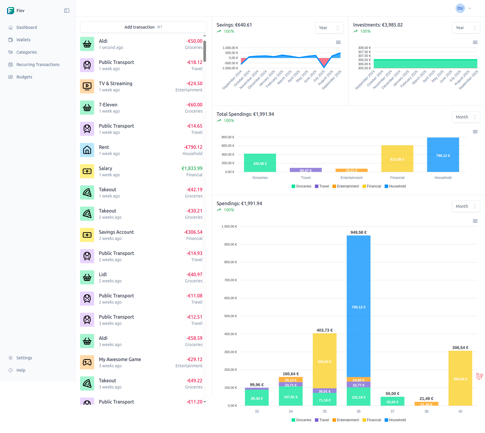

# Erste Schritte mit Fiov

Willkommen in der Fiov-Dokumentation! Diese Anleitung begleitet Sie bei der Einrichtung und Nutzung von Fiov, Ihrem persönlichen Werkzeug für einen klaren Finanzüberblick.

## Was ist Fiov?

Fiov ist eine moderne Open-Source-Anwendung für das Finanzmanagement. Sie wurde entwickelt, um Ihnen dabei zu helfen, Ihre Einnahmen und Ausgaben mühelos zu verfolgen, zu analysieren und zu verstehen. Mit einer intuitiven Benutzeroberfläche und datengestützten Einblicken gibt Fiov Ihnen die Kontrolle über Ihre finanzielle Situation zurück. Der Schutz Ihrer Daten hat dabei oberste Priorität.

## Kernkonzepte

Die Funktionsweise von Fiov basiert auf einigen einfachen, aber leistungsstarken Konzepten:

- **[Konten (Wallets)](/de/usage/wallets.md)**: Repräsentieren Sie Ihre realen Konten wie Girokonten, Kreditkarten oder Bargeldbestände. Jedes Konto fasst seine eigenen Transaktionen zusammen.
- **[Kategorien](/de/usage/categories.md)**: Dienen der Organisation Ihrer Transaktionen. Mithilfe von Regeln können Transaktionen sogar automatisch der richtigen Kategorie zugewiesen werden.
- **[Transaktionen](/de/usage/transactions.md)**: Bilden alle Ihre finanziellen Aktivitäten ab. Fiov unterstützt sowohl einmalige als auch wiederkehrende Transaktionen für Abonnements oder Gehälter.
- **[Budgets](/de/usage/budgets.md)**: Setzen Sie sich finanzielle Limits für bestimmte Kategorien und verfolgen Sie deren Einhaltung, um Ihre Sparziele zu erreichen.

## Erste Schritte

Um mit Fiov zu beginnen, wird die folgende Reihenfolge empfohlen:

1.  **[Installation und Einrichtung](/de/guide/getting-started.md)**: Folgen Sie der Anleitung zur Installation, um das Projekt auf Ihrem System einzurichten und für den ersten Start zu konfigurieren.
2.  **[Konten einrichten](/de/usage/wallets.md)**: Erstellen Sie zunächst ein oder mehrere Konten, um Ihre Finanzströme voneinander zu trennen.
3.  **[Kategorien definieren](/de/usage/categories.md)**: Legen Sie Ihre persönlichen Kategorien für Ausgaben und Einnahmen an.
4.  **[Transaktionen hinzufügen](/de/usage/transactions.md)**: Erfassen Sie Ihre ersten Transaktionen, um Ihre Konten mit Leben zu füllen.
5.  **[Budgets planen](/de/usage/budgets.md)**: Richten Sie Budgets ein, um Ihre Ausgaben zu kontrollieren und Ihre finanziellen Ziele zu erreichen.

## Brauchen Sie Hilfe?

Falls Fragen auftreten oder Sie Unterstützung benötigen, stehen Ihnen folgende Ressourcen zur Verfügung:

- Besuchen Sie unser [Community-Forum](https://github.com/pascalkleindienst/fiov/discussions), um sich mit anderen Nutzern auszutauschen.
- [Melden Sie ein Problem](https://github.com/pascalkleindienst/fiov/issues), wenn Sie einen Fehler gefunden haben oder einen Verbesserungsvorschlag haben.
