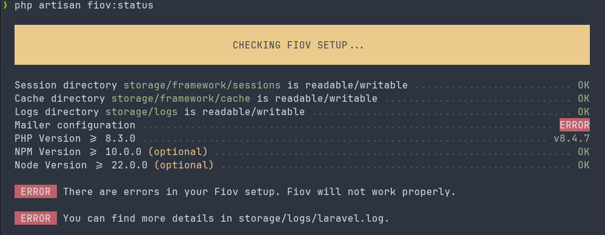

# Fehlerbehebung

Niemand ist perfekt und Dinge gehen manchmal schief. Alles halb so wild, hier sind einige häufige Probleme und ihre Lösungen:

## Erste Schritte

Wenn ein Fehler auftritt, sollte man zuerst in den Logs unter `storage/logs/laravel.log` schauen. Oftmals sieht man dann schon was genau schief gelaufen ist oder wo der Fehler auftritt.
Die Fehlermeldungen sind auch wichtig, falls ein [Ticket](https://github.com/pascalkleindienst/fiov/issues) erstellt werden muss.

::: danger Schaue immer zuerst ins Log
Der erste Schritt bei einem Fehler sollte immer ein Blick ins Logfile `storage/logs/laravel.log` sein 
:::

Als Nächstes sollte die Browserkonsole auf JavaScript-Fehler überprüft werden. Der "Netwerk" Tab in der Entwickler-Konsole kann auch auf fehlgeschlagene Anfragen geprüft werden.

Ein weiterer Schritt kann sein, den den Cache zu leeren, Abhängigkeiten neu zu installieren und die Frontend-Assets neu zu kompilieren.
Im Folgenden sind einige Befehle, die dabei helfen können:

```bash
# Vendor Verzeichnis löschen und Abhängigkeiten neu installieren
rm -rf vendor && composer install

# Frontend-Assets neu kompilieren
rm -rf node_modules && npm install && npm run build

# Application Cache löschen
php artisan cache:clear

# Config-Cache löschen
php artisan config:clear
```

### Fiov Status prüfen

Mit dem Befehl `php artisan fiov:status` kann man den Status von Fiov prüfen. Dabei werden alle relevanten Informationen ausgegeben, die helfen können, das Problem zu identifizieren.

```bash
php artisan fiov:status
```




## Häufige Probleme

::: details Berechtigungen
Stell sicher, dass der Webserver über die erforderlichen Berechtigungen verfügt, um *rekursiv* auf wichtige Ordner wie `storage`,
`bootstrap/cache` und `public` zuzugreifen.
Denk auch daran, Artisan-Befehle als Webserver-Benutzer (z. B. `www-data` oder `nginx`) auszuführen, und niemals als `root`,
da diese Befehle Dateien erstellen können, auf die der Webserver-Benutzer Zugriff haben muss.
:::


## Um Hilfe fragen

Falls du alleine nicht weiter kommst, kannst du auf [Github](https://github.com/pascalkleindienst/fiov/issues) ein Ticket erstellen. Denke daran, höflich und geduldig zu sein.
