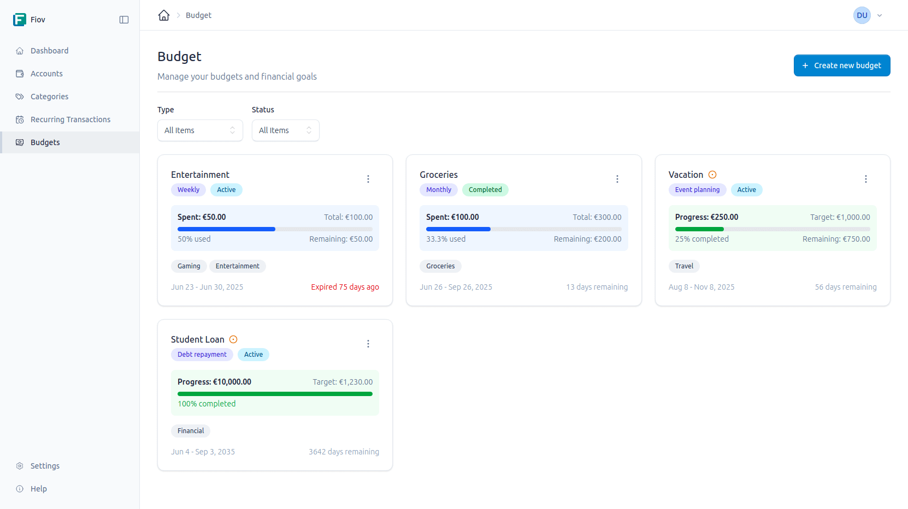
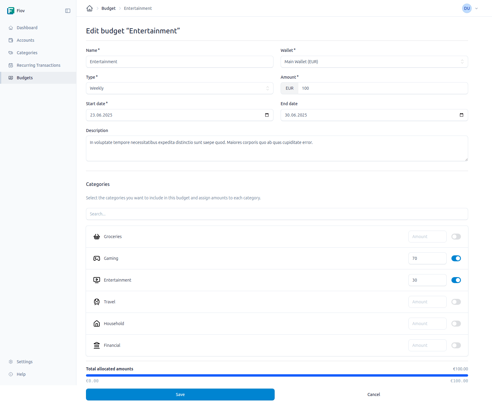

# Budgets

Budgets ermöglichen die Verfolgung und Verwaltung von Ausgaben über einen bestimmten Zeitraum. Sie dienen als Hilfsmittel, um finanzielle Ziele im Auge zu behalten und eine Überschreitung der Ausgaben zu vermeiden.

## Budget-Typen

Es können verschiedene Arten von Budgets erstellt werden:

- **Wiederkehrende Budgets:** Diese Budgets sind für sich wiederholende Zeiträume konzipiert.
    - **Wöchentlich:** Zur Verfolgung von wöchentlichen Ausgaben.
    - **Monatlich:** Eignet sich für die meisten Haushaltsbudgets.
    - **Jährlich:** Für größere, jährlich anfallende Ausgaben.

- **Zielbasierte Budgets:** Diese sind für spezifische Spar- oder Ausgabenziele vorgesehen.
    - **Sparziel:** Zum Sparen für einen bestimmten Zweck (*z.B. Urlaub*).
    - **Schuldentilgung:** Zur planmäßigen Rückzahlung von Schulden.
    - **Notfallfonds:** Zum Aufbau eines finanziellen Polsters.
    - **Größere Anschaffung:** Zum Sparen auf einen teuren Artikel.
    - **Veranstaltungsplanung:** Als Budget für eine Hochzeit, eine große Party usw.

## Ein Budget erstellen

Zur Erstellung eines neuen Budgets wird auf der Budget-Seite die Schaltfläche "Budget erstellen" verwendet. Anschließend öffnet sich ein Formular mit den folgenden Feldern:

- **Titel:** Ein aussagekräftiger Name für das Budget (*z.B. "Lebensmittel-Budget"*).
- **Beschreibung:** Eine optionale, detailliertere Beschreibung.
- **Wallet:** Hier wird das Wallet ausgewählt, für das dieses Budget gelten soll.
- **Priorität:** Dem Budget kann eine Priorität zugewiesen werden (*z.B. Hoch, Mittel, Niedrig*).
- **Budget-Typ:** Einer der oben beschriebenen Typen wird hier ausgewählt.
- **Startdatum:** Das Datum, an dem das Budget in Kraft tritt.
- **Enddatum:** Das Datum, an dem das Budget endet (*optional für einige Typen*).

### Kategorien und zugewiesene Beträge

Nachdem die grundlegenden Informationen eingegeben wurden, müssen die Kategorien zugewiesen werden, die dieses Budget abdecken soll.

1.  **Kategorien auswählen:** Es werden eine oder mehrere Ausgabenkategorien aus der Liste ausgewählt (*z.B. "Lebensmittel", "Transport"*). Die Liste kann durchsucht werden, um Kategorien schneller zu finden.
2.  **Betrag zuweisen:** Für jede ausgewählte Kategorie wird der Betrag eingegeben, der für diesen Zeitraum budgetiert werden soll.
3.  **Gesamtbetrag:** Der Gesamtbetrag des Budgets wird automatisch aus der Summe der zugewiesenen Beträge berechnet. Der verbleibende, noch nicht zugewiesene Betrag wird dabei angezeigt.

Mit einem Klick auf "Speichern" wird das Budget erstellt.

## Budgets verwalten

Auf der Hauptseite für Budgets befindet sich eine Übersicht aller erstellten Budgets. Jedes Budget wird als "Karte" dargestellt, welche die wichtigsten Informationen auf einen Blick anzeigt:

- **Fortschritt:** Ein Fortschrittsbalken visualisiert, wie viel des Budgets bereits ausgegeben wurde.
- **Verbleibender Betrag:** Der Betrag, der noch zur Verfügung steht.
- **Verbleibende Tage:** Die Anzahl der Tage bis zum Ende des Budgetzeitraums.

Ein Budget kann bearbeitet oder gelöscht werden, indem die entsprechenden Schaltflächen auf der Budget-Karte verwendet werden.

## Automatische Aktualisierung

Budgets werden automatisch aktualisiert. Bei jeder Erstellung einer neuen Transaktion, die einer Kategorie zugewiesen ist, die Teil eines aktiven Budgets ist, wird der ausgegebene Betrag vom Budget abgezogen. Dadurch ist stets ein aktueller Überblick über die Finanzen gewährleistet.
