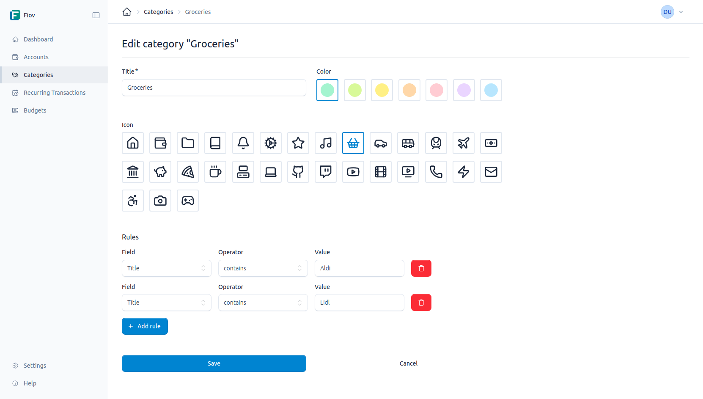

# Kategorien

Kategorien dienen dazu, Transaktionen zu gruppieren und zu organisieren. Jede Transaktion kann einer Kategorie zugewiesen werden, was eine detaillierte Analyse und Budgetierung der Ausgaben und Einnahmen ermöglicht.

## Kategorien verwalten

Die Verwaltung der Kategorien erfolgt über einen eigenen Bereich in der Anwendung. Hier können neue Kategorien erstellt, bestehende bearbeitet und nicht mehr benötigte gelöscht werden.

### Eine Kategorie erstellen

Beim Erstellen einer neuen Kategorie müssen die folgenden Informationen angegeben werden:

- **Titel:** Ein aussagekräftiger Name für die Kategorie (*z.B. "Lebensmittel", "Gehalt", "Versicherungen"*).
- **Icon:** Ein optionales Symbol, das die Kategorie visuell repräsentiert und die schnelle Identifizierung erleichtert.
- **Farbe:** Eine optionale Farbe zur weiteren visuellen Unterscheidung der Kategorien in Übersichten und Diagrammen.

### Kategorien bearbeiten

Bestehende Kategorien können jederzeit bearbeitet werden, um den Titel, das Icon oder die Farbe anzupassen.

## Automatischen Kategorisierung

Um die Zuweisung von Transaktionen zu Kategorien zu automatisieren, können Regeln definiert werden. Eine Regel besteht aus einer oder mehreren Bedingungen. Wenn eine neue Transaktion alle Bedingungen einer Regel erfüllt, wird sie automatisch der entsprechenden Kategorie zugewiesen.

### Regeln erstellen und verwalten

Regeln können beim Erstellen oder Bearbeiten einer Kategorie hinzugefügt und verwaltet werden.

Eine Regel besteht aus den folgenden drei Teilen:

- **Feld:** Das Feld der Transaktion, auf das sich die Regel beziehen soll (*z.B. "Titel", "Betrag"*).
- **Operator:** Der Vergleichsoperator, der auf das Feld angewendet wird.
- **Wert:** Der Wert, mit dem der Inhalt des Feldes verglichen wird.

### Verfügbare Operatoren

Die folgenden Operatoren stehen zur Verfügung, um flexible und präzise Regeln zu erstellen:

| Operator                | Beschreibung            |
|-------------------------|-------------------------|
| `equals`                | Ist gleich              |
| `not_equals`            | Ist ungleich            |
| `contains`              | Enthält                 |
| `not_contains`          | Enthält nicht           |
| `starts_with`           | Beginnt mit             |
| `not_starts_with`       | Beginnt nicht mit       |
| `ends_with`             | Endet mit               |
| `not_ends_with`         | Endet nicht mit         |
| `greater_than`          | Größer als              |
| `less_than`             | Kleiner als             |
| `greater_than_or_equal` | Größer als oder gleich  |
| `less_than_or_equal`    | Kleiner als oder gleich |

**Beispiel:**

Um alle Transaktionen, deren Titel das Wort *"Supermarkt"* enthält, automatisch der Kategorie *"Lebensmittel"* zuzuordnen, könnte die folgende Regel erstellt werden:

- **Feld:** `Titel`
- **Operator:** `enthält`
- **Wert:** `Supermarkt`

## Kategorien in Budgets

Kategorien können auch Budgets zugewiesen werden. Dies ermöglicht es, monatliche oder jährliche Ausgabenlimits für bestimmte Bereiche festzulegen und die Einhaltung dieser Budgets zu verfolgen.
Weitere Informationen dazu sind im Abschnitt [Budgets](./budgets.md) zu finden.
