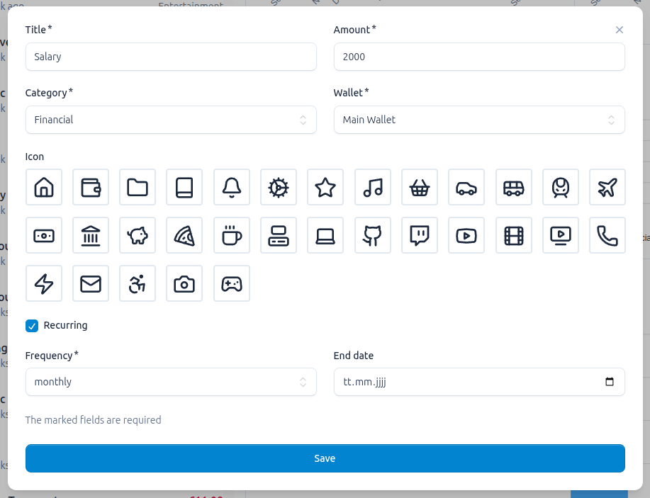
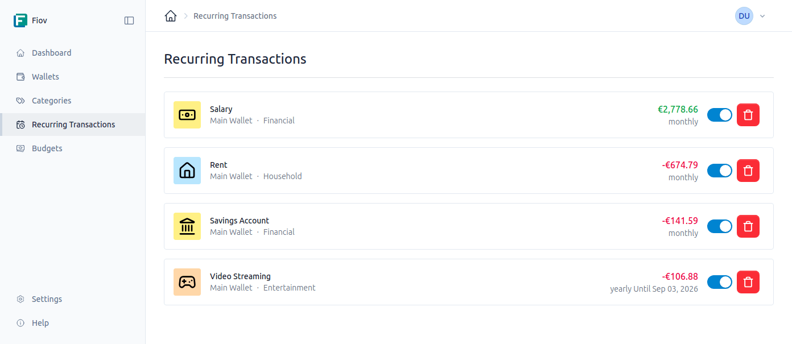

# Transaktionen

Transaktionen sind die grundlegenden Bausteine Ihrer Finanzübersicht. Jede Bewegung von Geld, sei es eine Einnahme oder eine Ausgabe, wird als Transaktion erfasst.

## Einzelne Transaktionen

Einzelne Transaktionen werden für einmalige Vorgänge verwendet.

### Eine Transaktion erstellen

Eine neue Transaktion kann direkt innerhalb eines [Kontos](./wallets.md) erstellt werden. Dabei werden die folgenden Informationen erfasst:

- **Konto:** Das Konto, dem die Transaktion zugeordnet ist.
- **Titel:** Eine kurze Beschreibung der Transaktion (z.B. "Einkauf im Supermarkt", "Monatsgehalt").
- **Betrag:** Der Geldbetrag. Ausgaben werden durch einen negativen Betrag (z.B. `-50.00`) und Einnahmen durch einen positiven Betrag (z.B. `2500.00`) dargestellt.
- **Kategorie:** Die [Kategorie](./categories.md), zu der die Transaktion gehört (z.B. "Lebensmittel", "Gehalt").
- **Icon:** Ein optionales Symbol zur visuellen Kennzeichnung.

## Wiederkehrende Transaktionen

Für regelmäßige Einnahmen oder Ausgaben, wie Miete, Gehälter oder Abonnements, können wiederkehrende Transaktionen erstellt werden. Diese dienen als Vorlage, aus der automatisch in festgelegten Intervallen einzelne Transaktionen generiert werden.

### Eine wiederkehrende Transaktion erstellen

Die Erstellung erfolgt ähnlich wie bei einer einzelnen Transaktion, jedoch mit zusätzlichen Feldern zur Steuerung der Wiederholung:

- **Frequenz:** Das Intervall, in dem die Transaktion erstellt werden soll. Die verfügbaren Optionen sind:
    - Täglich (`daily`)
    - Wöchentlich (`weekly`)
    - Monatlich (`monthly`)
    - Jährlich (`yearly`)
- **Startdatum:** Das Datum, an dem die erste Transaktion generiert wird.
- **Enddatum (optional):** Das Datum, an dem die Wiederholung endet. Wird kein Enddatum festgelegt, läuft die Transaktion unbegrenzt weiter.

Das System erstellt dann automatisch am fälligen Datum eine neue Transaktion basierend auf der Vorlage.

### Wiederkehrende Transaktionen verwalten

Die Vorlagen für wiederkehrende Transaktionen können in einem eigenen Bereich verwaltet werden. Hier können sie bearbeitet oder deaktiviert werden, um die automatische Generierung zukünftiger Transaktionen zu stoppen.

