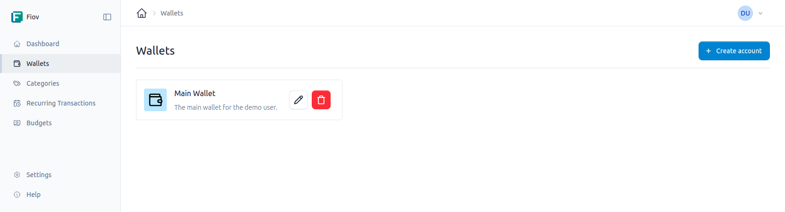
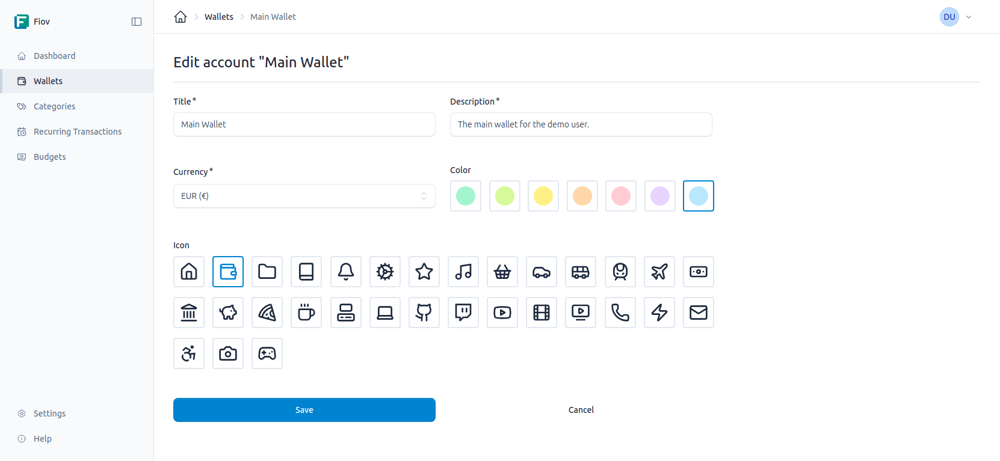

# Konten

Konten (*oder Wallets*) sind das zentrale Element zur Organisation Ihrer Finanzen. Sie repräsentieren Ihre verschiedenen finanziellen Konten, wie z.B. ein Girokonto, ein Sparkonto, eine Kreditkarte oder Bargeld.

Jedes Konto funktioniert als separater Container für Transaktionen, was eine klare Trennung und Verwaltung Ihrer Geldflüsse ermöglicht.

## Konten verwalten

Im Bereich "Konten" können neue Konten angelegt, bestehende bearbeitet und nicht mehr genutzte archiviert werden.

### Ein Konto erstellen

Beim Anlegen eines neuen Kontos werden die folgenden Informationen benötigt:

- **Titel:** Ein eindeutiger Name für das Konto (z.B. "Girokonto", "Kreditkarte VISA", "Bargeld").
- **Beschreibung:** Eine optionale, ausführlichere Beschreibung des Kontos.
- **Währung:** Die Währung, in der das Konto geführt wird. Diese Einstellung legt die Währung für alle Transaktionen innerhalb dieses Kontos fest.
- **Icon:** Ein optionales Symbol zur visuellen Kennzeichnung des Kontos.
- **Farbe:** Eine optionale Farbe, die zur besseren Unterscheidung in Listen und Übersichten dient.

### Konten bearbeiten

Die Details eines bestehenden Kontos können jederzeit geändert werden.

### Konten löschen
Wenn ein Konto gelöscht werden soll, werden dadurch auch die zugehörigen Transaktionen gelöscht.

::: warning Warnung
Es muss immer mindestens ein Konto vorhanden sein.
:::

## Transaktionen

Jedes Konto besitzt sein eigenes Transaktionsprotokoll. Wenn eine neue Transaktion erstellt wird, muss sie immer einem spezifischen Konto zugewiesen werden. Dies stellt sicher, dass alle Einnahmen und Ausgaben korrekt zugeordnet sind und der Kontostand präzise berechnet werden kann.
