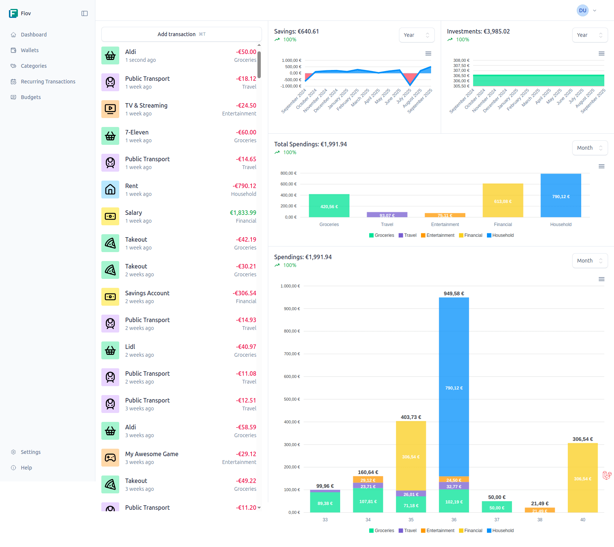

# Getting Started with Fiov

Welcome to the Fiov documentation! This guide will accompany you in setting up and using Fiov, your personal tool for a clear financial overview.

## What is Fiov?

Fiov is a modern open-source application for financial management. It was developed to help you effortlessly track, analyze, and understand your income and expenses. With an intuitive user interface and data-driven insights, Fiov gives you back control over your financial situation. The protection of your data has the highest priority.

## Core Concepts

Fiov's functionality is based on some simple but powerful concepts:

- **[Accounts (Wallets)](/en/usage/wallets.md)**: Represent your real accounts such as checking accounts, credit cards, or cash holdings. Each account consolidates its own transactions.
- **[Categories](/en/usage/categories.md)**: Serve to organize your transactions. Using rules, transactions can even be automatically assigned to the correct category.
- **[Transactions](/en/usage/transactions.md)**: Map all your financial activities. Fiov supports both one-time and recurring transactions for subscriptions or salaries.
- **[Budgets](/en/usage/budgets.md)**: Set financial limits for specific categories and track their compliance to achieve your savings goals.

## Getting Started

To begin with Fiov, the following sequence is recommended:

1.  **[Installation and Setup](/en/guide/getting-started.md)**: Follow the installation guide to set up the project on your system and configure it for the first start.
2.  **[Set up Accounts](/en/usage/wallets.md)**: First create one or more accounts to separate your financial flows from each other.
3.  **[Define Categories](/en/usage/categories.md)**: Create your personal categories for expenses and income.
4.  **[Add Transactions](/en/usage/transactions.md)**: Record your first transactions to bring your accounts to life.
5.  **[Plan Budgets](/en/usage/budgets.md)**: Set up budgets to control your expenses and achieve your financial goals.

## Need Help?

If questions arise or you need support, the following resources are available to you:

- Visit our [Community Forum](https://github.com/pascalkleindienst/fiov/discussions) to connect with other users.
- [Report an Issue](https://github.com/pascalkleindienst/fiov/issues) if you have found a bug or have a suggestion for improvement.
