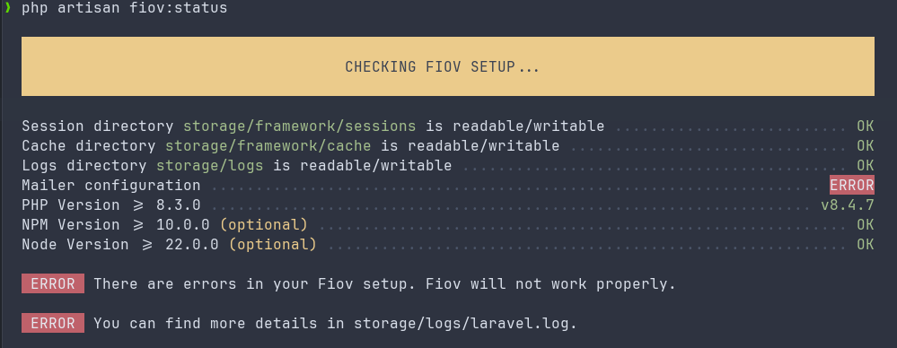

# Troubleshooting

Nobody is perfect and things sometimes go wrong. It's not the end of the world, here are some common problems and their solutions:

## Getting Started

When an error occurs, you should first look at the logs under `storage/logs/laravel.log`. Often you can already see what exactly went wrong or where the error occurs.
The error messages are also important if a [ticket](https://github.com/pascalkleindienst/fiov/issues) needs to be created.

::: danger Always check the log first
The first step when encountering an error should always be to look at the log file `storage/logs/laravel.log`
:::

Next, the browser console should be checked for JavaScript errors. The "Network" tab in the developer console can also be checked for failed requests.

Another step can be to clear the cache, reinstall dependencies and recompile the frontend assets.
Below are some commands that can help with this:

```bash
# Delete vendor directory and reinstall dependencies
rm -rf vendor && composer install

# Recompile frontend assets
rm -rf node_modules && npm install && npm run build

# Clear application cache
php artisan cache:clear

# Clear config cache
php artisan config:clear
```

### Check Fiov Status

With the command `php artisan fiov:status` you can check the status of Fiov. This will output all relevant information that can help identify the problem.

```bash
php artisan fiov:status
```




## Common Problems

### Permission Issues
It must be ensured that the `storage` and `bootstrap/cache` directories are writable. These folders are used by Laravel to store cache files, session data, compiled templates, and log files. Without appropriate write permissions, various application functions cannot be executed properly.
```bash
chmod -R 775 storage bootstrap/cache
```

Additionally, it should be verified that the web server user (usually `www-data`, `apache`, or `nginx`) owns these directories:
```bash
chown -R www-data:www-data storage bootstrap/cache
```

### Composer Memory Limit
If memory limit issues occur during the installation of PHP dependencies, the memory limit can be temporarily lifted. This is particularly necessary for larger projects or on servers with limited RAM. The problem usually manifests through error messages like "Fatal error: Allowed memory size exhausted".
```bash
COMPOSER_MEMORY_LIMIT=-1 composer install
```
Alternatively, the PHP memory limit can also be permanently increased in the `php.ini`:
```ini
memory_limit = 512M
```

### Node.js Version
It must be ensured that a compatible Node.js version (20.x or higher) is used. Older versions can lead to compilation errors with frontend assets or may not support modern JavaScript features. The currently installed version can be checked with the following command:
```bash
node --version
npm --version
```
For managing different Node.js versions, using nvm (Node Version Manager) is recommended, which allows easy switching between different Node.js versions:
```bash
# Install nvm (on Linux/macOS)
curl -o- https://raw.githubusercontent.com/nvm-sh/nvm/v0.39.0/install.sh | bash

# Install and use latest LTS version
nvm install --lts
nvm use --lts
```


## Asking for Help

If you can't figure it out on your own, you can create a ticket on [Github](https://github.com/pascalkleindienst/fiov/issues). Remember to be polite and patient.
