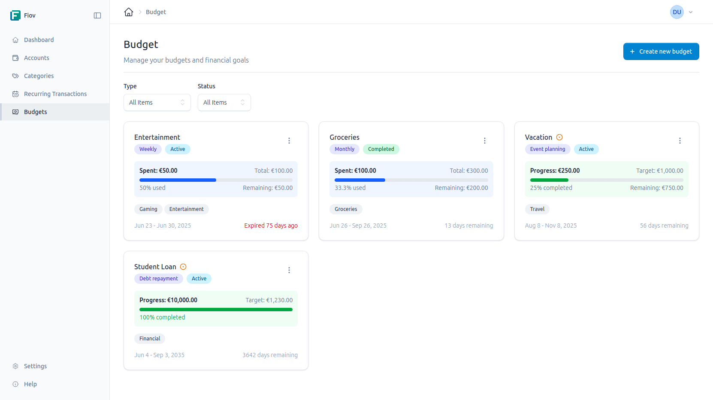

# Budgets

Budgets enable tracking and managing expenses over a specific period. They serve as a tool to keep financial goals in sight and avoid overspending.

## Budget Types

Various types of budgets can be created:

- **Recurring Budgets:** These budgets are designed for repeating time periods.
    - **Weekly:** For tracking weekly expenses.
    - **Monthly:** Suitable for most household budgets.
    - **Yearly:** For larger, annually occurring expenses.

- **Goal-based Budgets:** These are intended for specific saving or spending goals.
    - **Savings Goal:** For saving for a specific purpose (*e.g., vacation*).
    - **Debt Repayment:** For systematic debt repayment.
    - **Emergency Fund:** For building a financial cushion.
    - **Major Purchase:** For saving for an expensive item.
    - **Event Planning:** As a budget for a wedding, large party, etc.

## Creating a Budget

To create a new budget, use the "Create Budget" button on the budget page. This will open a form with the following fields:

- **Title:** A meaningful name for the budget (*e.g., "Grocery Budget"*).
- **Description:** An optional, more detailed description.
- **Wallet:** Select the wallet to which this budget should apply.
- **Priority:** A priority can be assigned to the budget (*e.g., High, Medium, Low*).
- **Budget Type:** One of the types described above is selected here.
- **Start Date:** The date when the budget takes effect.
- **End Date:** The date when the budget ends (*optional for some types*).

### Categories and Allocated Amounts

After entering the basic information, the categories that this budget should cover must be assigned.

1.  **Select Categories:** One or more expense categories are selected from the list (*e.g., "Groceries", "Transportation"*). The list can be searched to find categories more quickly.
2.  **Assign Amount:** For each selected category, enter the amount to be budgeted for this period.
3.  **Total Amount:** The total budget amount is automatically calculated from the sum of the allocated amounts. The remaining, not yet allocated amount is displayed.

Click "Save" to create the budget.

## Managing Budgets

On the main budget page, there is an overview of all created budgets. Each budget is displayed as a "card" that shows the most important information at a glance:

- **Progress:** A progress bar visualizes how much of the budget has already been spent.
- **Remaining Amount:** The amount that is still available.
- **Remaining Days:** The number of days until the end of the budget period.

A budget can be edited or deleted by using the corresponding buttons on the budget card.

## Automatic Updates

Budgets are automatically updated. Whenever a new transaction is created that is assigned to a category that is part of an active budget, the spent amount is deducted from the budget. This ensures an always current overview of finances.
