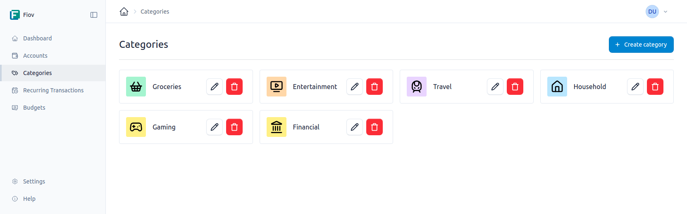
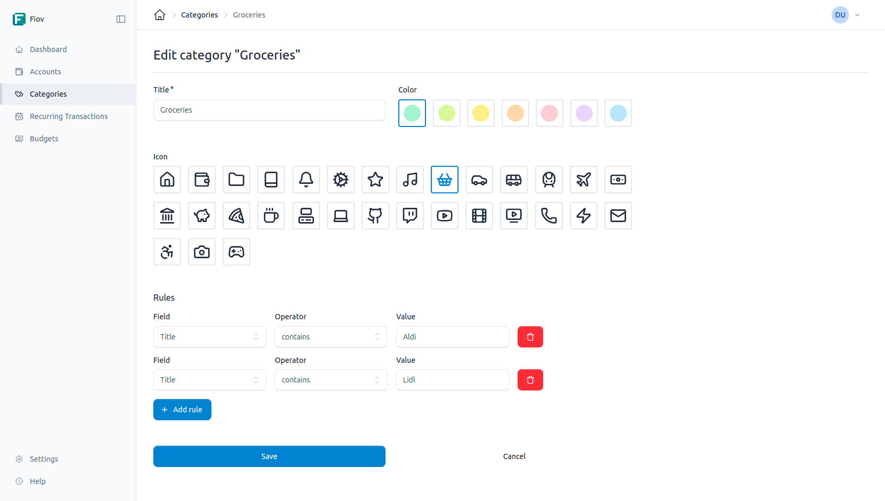

# Categories

Categories serve to group and organize transactions. Each transaction can be assigned to a category, enabling detailed analysis and budgeting of expenses and income.

## Managing Categories

Category management is handled through a dedicated area in the application. Here, new categories can be created, existing ones edited, and those no longer needed can be deleted.

### Creating a Category

When creating a new category, the following information must be provided:

- **Title:** A meaningful name for the category (*e.g., "Groceries", "Salary", "Insurance"*).
- **Icon:** An optional symbol that visually represents the category and facilitates quick identification.
- **Color:** An optional color for further visual distinction of categories in overviews and charts.

### Editing Categories

Existing categories can be edited at any time to adjust the title, icon, or color.

## Automatic Categorization

To automate the assignment of transactions to categories, rules can be defined. A rule consists of one or more conditions. When a new transaction meets all conditions of a rule, it is automatically assigned to the corresponding category.

### Creating and Managing Rules

Rules can be added and managed when creating or editing a category.

A rule consists of the following three parts:

- **Field:** The transaction field to which the rule should refer (*e.g., "Title", "Amount"*).
- **Operator:** The comparison operator applied to the field.
- **Value:** The value with which the field content is compared.

### Available Operators

The following operators are available to create flexible and precise rules:

| Operator                | Description             |
|-------------------------|-------------------------|
| `equals`                | Is equal                |
| `not_equals`            | Is not equal            |
| `contains`              | Contains                |
| `not_contains`          | Does not contain        |
| `starts_with`           | Starts with             |
| `not_starts_with`       | Does not start with     |
| `ends_with`             | Ends with               |
| `not_ends_with`         | Does not end with       |
| `greater_than`          | Greater than            |
| `less_than`             | Less than               |
| `greater_than_or_equal` | Greater than or equal   |
| `less_than_or_equal`    | Less than or equal      |

**Example:**

To automatically assign all transactions whose title contains the word *"Supermarket"* to the *"Groceries"* category, the following rule could be created:

- **Field:** `Title`
- **Operator:** `contains`
- **Value:** `Supermarket`

## Categories in Budgets

Categories can also be assigned to budgets. This makes it possible to set monthly or yearly spending limits for specific areas and track compliance with these budgets.
More information can be found in the [Budgets](./budgets.md) section.
