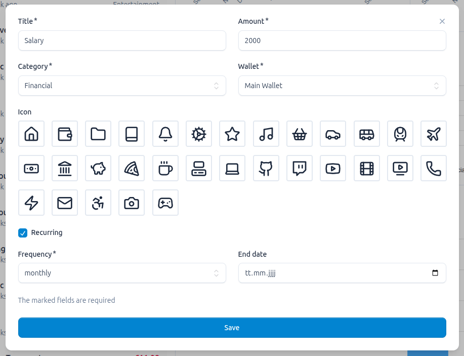
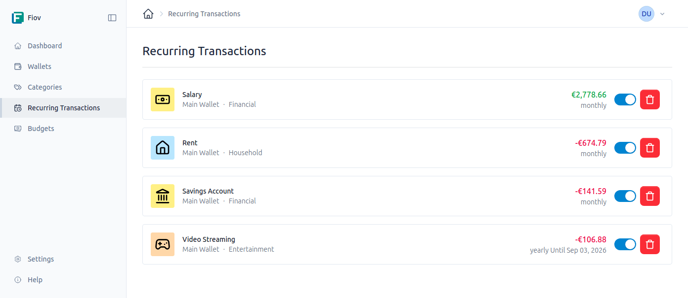

# Transactions

Transactions are the fundamental building blocks of your financial overview. Every movement of money, whether it's income or an expense, is recorded as a transaction.

## Individual Transactions

Individual transactions are used for one-time events.

### Creating a Transaction

A new transaction can be created directly within an [account](./wallets.md). The following information is captured:

- **Account:** The account to which the transaction is assigned.
- **Title:** A brief description of the transaction (e.g., "Grocery Shopping", "Monthly Salary").
- **Amount:** The monetary amount. Expenses are represented by a negative amount (e.g., `-50.00`) and income by a positive amount (e.g., `2500.00`).
- **Category:** The [category](./categories.md) to which the transaction belongs (e.g., "Groceries", "Salary").
- **Icon:** An optional symbol for visual identification.

## Recurring Transactions

For regular income or expenses, such as rent, salaries, or subscriptions, recurring transactions can be created. These serve as templates from which individual transactions are automatically generated at defined intervals.

### Creating a Recurring Transaction

Creation is similar to an individual transaction, but with additional fields to control the recurrence:

- **Frequency:** The interval at which the transaction should be created. The available options are:
    - Daily (`daily`)
    - Weekly (`weekly`)
    - Monthly (`monthly`)
    - Yearly (`yearly`)
- **Start Date:** The date when the first transaction will be generated.
- **End Date (optional):** The date when the recurrence ends. If no end date is set, the transaction continues indefinitely.

The system then automatically creates a new transaction based on the template on the due date.

### Managing Recurring Transactions

The templates for recurring transactions can be managed in a dedicated area. Here they can be edited or deactivated to stop the automatic generation of future transactions.

