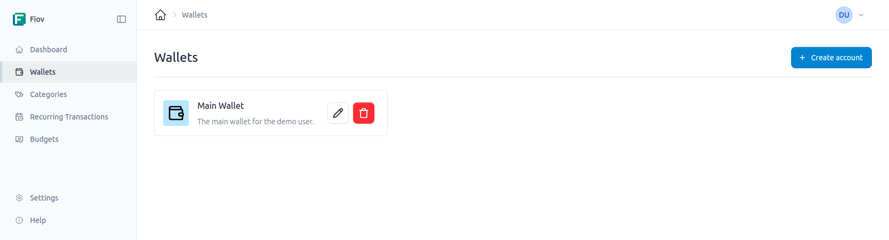

# Wallets

Wallets are the central element for organizing your finances. They represent your various financial accounts, such as a checking account, savings account, credit card, or cash.

Each wallet functions as a separate container for transactions, enabling clear separation and management of your money flows.

## Managing Wallets

In the "Wallets" section, new wallets can be created, existing ones edited, and unused ones archived.

### Creating Wallet

When creating a new wallet, the following information is required:

- **Title:** A unique name for the wallet (e.g., "Checking Account", "VISA Credit Card", "Cash").
- **Description:** An optional, more detailed description of the wallet.
- **Currency:** The currency in which the wallet is maintained. This setting determines the currency for all transactions within this wallet.
- **Icon:** An optional symbol for visual identification of the wallet.
- **Color:** An optional color that serves for better distinction in lists and overviews.

### Editing Wallets

The details of an existing wallet can be changed at any time.

### Deleting Wallets
When an wallet is deleted, the associated transactions are also deleted.

::: warning Warning
At least one wallet must always exist.
:::

## Transactions

Each wallet has its own transaction log. When a new transaction is created, it must always be assigned to a specific wallet. This ensures that all income and expenses are correctly allocated and the wallet balance can be calculated precisely.
